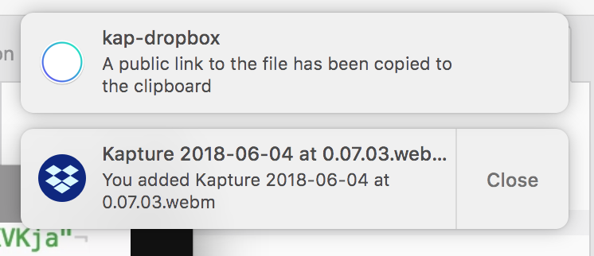

# kap-dropbox

> [Kap](https://github.com/wulkano/kap) plugin - Upload recordings to [Dropbox](https://dropbox.com)

## Install

In the `Kap` menu, go to `Preferences…`, select the `Plugins` pane, find this plugin, and click `Install`.

## Usage

In the editor, after recording, select a format, and then `Upload to Dropbox`.

## Options

In the `plugins` pane, click `Open plugins folder` and edit the `kap-dropbox.json` file to change options

Available options:

#### path
Type: `String`

When provided, uploads will be placed in that directory. For example, to upload recordings under a directory called Kaptures, set `path` to `/Kaptures`. If the directory doesn't exist it will be created.

#### autorename
Type: `Boolean`
Default: `true`

When set to true, if there is a conflict (the file already exists) the new upload will automatically be renamed in order to keep both

#### mute
Type: `Boolean`
Default: `false`

When set to true, the dropbox app(s) won't show a notification for this upload

Used to avoid this:

## License

MIT © [George Karagkiaouris](https://gkaragkiaouris.com)
